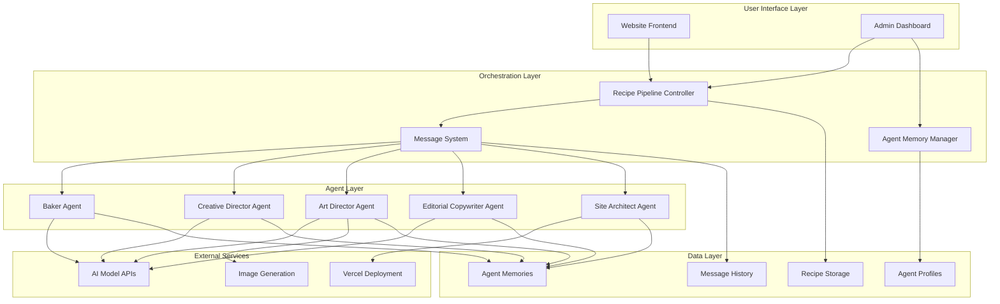

# Design Document

## Overview

The AI Creative Team System is a multi-agent orchestration platform that simulates a realistic creative workplace where AI agents with distinct personalities collaborate to produce muffin tin recipes. The system emphasizes authentic character interactions, persistent personality development, and entertainment value through workplace dynamics.

The architecture supports a core team of five agents (Baker, Creative Director, Art Director, Editorial Copywriter, Site Architect) with planned expansion to include Screenwriters and Social Media Specialist. Each agent maintains persistent memory, communicates through structured messaging, and exhibits consistent personality traits that create natural workplace tension and collaboration.

## Architecture

### Technology Stack Clarification

**Backend**: Python - All AI agent orchestration, message systems, pipeline management, and data processing will be implemented in Python.

**Frontend**: Static HTML + Tailwind CSS (existing) - The current static website architecture remains unchanged except for two specific additions:
1. Featured recipe section above the existing recipe grid
2. Newsletter signup form between the featured section and recipe grid

**No Changes to Existing Frontend**: The current recipe grid, styling, mobile responsiveness, and "Jump to Recipe" functionality remain exactly as implemented.

### High-Level Architecture



### Core Design Principles

1. **Personality-First Architecture**: Every system component is designed to support and enhance agent personalities rather than optimize for pure efficiency
2. **Authentic Workplace Simulation**: Communication patterns, decision-making processes, and conflict resolution mirror real creative team dynamics
3. **Persistent Character Development**: Agent memories and relationships evolve over time, creating continuity and growth
4. **Entertainment Value**: System generates engaging behind-the-scenes content through natural agent interactions
5. **Modular Expansion**: Architecture supports adding new agent types without disrupting existing workflows

## Components and Interfaces

### Agent Framework

#### Agent Base Class
```python
class Agent:
    def __init__(self, role: str, personality_config: PersonalityConfig):
        self.role = role
        self.personality = personality_config
        self.memory = AgentMemory(role)
        self.message_handler = MessageHandler(role)
        
    def process_task(self, task: Task) -> TaskResult:
        # Consult memory for personality-relevant context
        context = self.memory.get_relevant_context(task)
        
        # Apply personality traits to decision-making
        approach = self.personality.influence_approach(task, context)
        
        # Execute task with personality-driven behavior
        result = self.execute_with_personality(task, approach)
        
        # Store experience in memory
        self.memory.record_experience(task, result, self.get_emotional_response())
        
        return result
        
    def send_message(self, recipient: str, content: str, message_type: MessageType):
        message = self.personality.style_message(content, recipient, message_type)
        self.message_handler.send(recipient, message)
        
    def receive_message(self, sender: str, message: Message) -> Optional[Message]:
        # Process message through personality filter
        response = self.personality.generate_response(message, self.memory)
        if response:
            self.memory.record_interaction(sender, message, response)
        return response
```

#### Personality Configuration System
```python
class PersonalityConfig:
    def __init__(self, 
                 core_traits: Dict[str, float],
                 backstory: str,
                 communication_style: CommunicationStyle,
                 quirks: List[str],
                 triggers: List[str]):
        self.core_traits = core_traits  # e.g., {"grumpiness": 0.8, "perfectionism": 0.9}
        self.backstory = backstory
        self.communication_style = communication_style
        self.quirks = quirks
        self.triggers = triggers  # Things that cause strong reactions
        
    def influence_approach(self, task: Task, context: MemoryContext) -> TaskApproach:
        # Apply personality traits to modify task execution
        approach = TaskApproach(base_strategy=task.default_strategy)
        
        # Modify based on core traits
        if self.core_traits.get("perfectionism", 0) > 0.7:
            approach.add_extra_validation_steps()
            
        if self.core_traits.get("traditionalism", 0) > 0.6:
            approach.prefer_established_methods()
            
        # Apply quirks and triggers
        for trigger in self.triggers:
            if trigger in task.content:
                approach.add_emotional_reaction(trigger)
                
        return approach
```

### Message System

#### Message Types and Routing
```python
class MessageType(Enum):
    TASK_ASSIGNMENT = "task_assignment"
    FEEDBACK_REQUEST = "feedback_request"
    REVISION_REQUEST = "revision_request"
    APPROVAL_NOTIFICATION = "approval_notification"
    CREATIVE_SUGGESTION = "creative_suggestion"
    GOSSIP = "gossip"  # Future feature
    
class Message:
    def __init__(self, 
                 sender: str,
                 recipient: str,
                 content: str,
                 message_type: MessageType,
                 context: Optional[Dict] = None):
        self.sender = sender
        self.recipient = recipient
        self.content = content
        self.message_type = message_type
        self.context = context or {}
        self.timestamp = datetime.now()
        self.id = generate_message_id()

class MessageSystem:
    def __init__(self):
        self.message_queue = {}  # recipient -> List[Message]
        self.message_history = []
        self.gossip_channels = {}  # Future feature
        
    def send_message(self, message: Message):
        # Add to recipient's queue
        if message.recipient not in self.message_queue:
            self.message_queue[message.recipient] = []
        self.message_queue[message.recipient].append(message)
        
        # Log for process documentation
        self.message_history.append(message)
        
    def get_messages_for_agent(self, agent_role: str) -> List[Message]:
        return self.message_queue.get(agent_role, [])
        
    def mark_message_processed(self, message_id: str, response: Optional[Message] = None):
        # Remove from queue and optionally send response
        if response:
            self.send_message(response)
```

### Recipe Pipeline Controller

#### Pipeline State Management
```python
class PipelineStage(Enum):
    IDEATION = "ideation"
    RECIPE_CREATION = "recipe_creation"
    COPYWRITING = "copywriting"
    PHOTOGRAPHY = "photography"
    CREATIVE_REVIEW = "creative_review"
    REVISION = "revision"
    DEPLOYMENT = "deployment"
    COMPLETED = "completed"

class RecipePipeline:
    def __init__(self, message_system: MessageSystem, agents: Dict[str, Agent]):
        self.message_system = message_system
        self.agents = agents
        self.active_recipes = {}  # recipe_id -> PipelineState
        
    def start_recipe_production(self, recipe_idea: str) -> str:
        recipe_id = generate_recipe_id()
        self.active_recipes[recipe_id] = PipelineStage.RECIPE_CREATION
        
        # Send initial task to Baker
        task_message = Message(
            sender="system",
            recipient="baker",
            content=f"Create a muffin tin recipe based on: {recipe_idea}",
            message_type=MessageType.TASK_ASSIGNMENT,
            context={"recipe_id": recipe_id}
        )
        self.message_system.send_message(task_message)
        
        return recipe_id
        
    def advance_pipeline(self, recipe_id: str, completed_stage: PipelineStage):
        current_stage = self.active_recipes[recipe_id]
        next_stage = self.get_next_stage(current_stage)
        
        if next_stage:
            self.active_recipes[recipe_id] = next_stage
            self.assign_next_task(recipe_id, next_stage)
        else:
            self.active_recipes[recipe_id] = PipelineStage.COMPLETED
            
    def assign_next_task(self, recipe_id: str, stage: PipelineStage):
        stage_assignments = {
            PipelineStage.COPYWRITING: "editorial_copywriter",
            PipelineStage.PHOTOGRAPHY: "art_director", 
            PipelineStage.CREATIVE_REVIEW: "creative_director",
            PipelineStage.DEPLOYMENT: "site_architect"
        }
        
        if stage in stage_assignments:
            agent_role = stage_assignments[stage]
            task_message = self.create_stage_task_message(recipe_id, stage, agent_role)
            self.message_system.send_message(task_message)
```

## Data Models

### Agent Profile Schema
```python
@dataclass
class AgentProfile:
    role: str
    name: str
    age: int
    gender: str
    personality_traits: Dict[str, float]
    backstory: str
    communication_style: str
    quirks: List[str]
    triggers: List[str]
    current_mood: float  # -1.0 to 1.0
    relationships: Dict[str, float]  # other_agent -> relationship_score
    
    # Specific personality details
    baker_traditionalism_level: Optional[float] = None
    creative_director_pressure_level: Optional[float] = None
    art_director_pretentiousness: Optional[float] = None
    copywriter_frustration_level: Optional[float] = None
    site_architect_laziness: Optional[float] = None

@dataclass 
class AgentMemory:
    agent_role: str
    formative_experiences: List[Dict]
    emotional_responses: List[Dict]
    creative_preferences: Dict[str, Any]
    relationship_history: Dict[str, List[Dict]]
    character_growth_moments: List[Dict]
    
    def record_experience(self, task: Task, result: TaskResult, emotion: EmotionalResponse):
        experience = {
            "timestamp": datetime.now(),
            "task_type": task.type,
            "outcome": result.success,
            "emotional_impact": emotion.intensity,
            "personality_influence": emotion.personality_factors,
            "lessons_learned": result.insights
        }
        
        if emotion.intensity > 0.7:  # Significant emotional impact
            self.formative_experiences.append(experience)
        else:
            self.emotional_responses.append(experience)
```

### Recipe and Production Schema
```python
@dataclass
class Recipe:
    id: str
    slug: str
    title: str
    description: str
    why_muffin_pans: str
    category: RecipeCategory
    yield_info: YieldInfo
    prep_time_minutes: int
    cook_time_minutes: int
    ingredients: List[Ingredient]
    instructions: List[Instruction]
    tips: List[str]
    image_path: str
    created_at: datetime
    
    # Creative process tracking
    creation_story: CreationStory
    agent_contributions: Dict[str, AgentContribution]
    editorial_notes: Dict[str, str]
    
@dataclass
class CreationStory:
    recipe_id: str
    timeline: List[CreationEvent]
    key_decisions: List[Decision]
    conflicts_and_resolutions: List[Conflict]
    final_outcome: str
    
    def generate_story_summary(self) -> str:
        # Create curated narrative for public consumption
        pass
        
    def generate_full_story(self) -> str:
        # Complete behind-the-scenes documentation
        pass

@dataclass
class CreationEvent:
    timestamp: datetime
    agent: str
    action: str
    details: str
    emotional_context: Optional[str] = None
    
@dataclass
class Conflict:
    participants: List[str]
    issue: str
    positions: Dict[str, str]  # agent -> their position
    resolution: str
    resolution_method: str  # compromise, creative_director_decision, etc.
```

### Message and Communication Schema
```python
@dataclass
class MessageHistory:
    recipe_id: str
    conversation_threads: List[ConversationThread]
    
@dataclass
class ConversationThread:
    participants: List[str]
    topic: str
    messages: List[Message]
    outcome: Optional[str] = None
    
    def extract_personality_moments(self) -> List[PersonalityMoment]:
        # Identify moments where personality traits were clearly displayed
        moments = []
        for message in self.messages:
            if self.shows_personality_trait(message):
                moments.append(PersonalityMoment(
                    agent=message.sender,
                    trait_displayed=self.identify_trait(message),
                    context=message.content,
                    timestamp=message.timestamp
                ))
        return moments
```

## Correctness Properties

*A property is a characteristic or behavior that should hold true across all valid executions of a system-essentially, a formal statement about what the system should do. Properties serve as the bridge between human-readable specifications and machine-verifiable correctness guarantees.*

Based on the prework analysis, the following properties ensure the AI Creative Team System operates correctly:

### Property 1: Agent Personality Persistence
*For any* system restart or reinitialization, each agent role should maintain the exact same personality traits, backstory, and behavioral parameters as before the restart.
**Validates: Requirements 1.2**

### Property 2: Agent Initialization Completeness  
*For any* agent initialization, the resulting agent should have all required personality components: core traits, backstory, communication style, quirks, and triggers.
**Validates: Requirements 1.3**

### Property 3: Pipeline Stage Completeness
*For any* recipe idea submitted to the pipeline, the system should process it through all required stages (recipe creation, copywriting, photography, creative review, deployment) without skipping any stage.
**Validates: Requirements 2.1**

### Property 4: Baker Recipe Creation
*For any* recipe creation task assigned to the Baker, the output should include a recipe concept, ingredient list with quantities, and cooking instructions appropriate for muffin tin format.
**Validates: Requirements 2.2**

### Property 5: Agent Memory Persistence
*For any* agent in the system, there should exist a persistent memory file that contains personality-focused experiences rather than operational data.
**Validates: Requirements 3.1**

### Property 6: Experience Recording
*For any* significant agent experience (high emotional impact), the system should record the experience with emotional context, personality factors, and character development insights in the agent's memory.
**Validates: Requirements 3.2**

### Property 7: Creative Director Review Consistency
*For any* complete recipe package, the Creative Director should apply consistent quality standards and provide feedback that reflects their personality traits (supportive but under pressure).
**Validates: Requirements 6.1, 6.2**

### Property 8: Message Delivery Accuracy
*For any* message sent between agents, the message should be delivered only to the specified recipient with all metadata (sender, timestamp, content) intact.
**Validates: Requirements 10.1, 10.2**

### Property 9: Message Logging Completeness
*For any* inter-agent message sent through the system, it should be logged with sender, recipient, timestamp, message type, and content for process documentation.
**Validates: Requirements 10.3**

### Property 10: Featured Recipe Display Update
*For any* recipe selected as the featured recipe, the website display should update to show that recipe in the featured section within the expected timeframe.
**Validates: Requirements 12.2**

### Property 11: Email Validation
*For any* email address submitted to the newsletter signup, the system should correctly validate the email format and only accept properly formatted email addresses.
**Validates: Requirements 13.2**

## Error Handling

### Agent Communication Failures
- **Message Delivery Failures**: If an agent is unavailable, messages are queued and delivered when the agent becomes available
- **Personality Loading Errors**: If personality configuration is corrupted, the system falls back to default personality templates while logging the error
- **Memory Corruption**: If agent memory files are corrupted, the system creates new memory files while preserving any recoverable data

### Pipeline Failures
- **Agent Task Failures**: If an agent fails to complete a task, the Creative Director is notified and can reassign the task or request revision
- **Stage Timeout**: If a pipeline stage takes too long, the system notifies the Creative Director and provides options to intervene
- **Quality Gate Failures**: If the Creative Director rejects a recipe multiple times, the system escalates to human oversight

### Data Integrity
- **Recipe Data Validation**: All recipe data is validated against the schema before storage
- **Message History Integrity**: Message logs are checksummed to prevent tampering
- **Memory Consistency**: Agent memories are validated for consistency and backed up regularly

### Graceful Degradation
- **AI Model Unavailability**: If an AI model is unavailable, agents can operate with reduced functionality using cached responses
- **External Service Failures**: If image generation or deployment services fail, the pipeline pauses at that stage rather than failing completely
- **Personality Conflicts**: If agent personalities create deadlocks, the Creative Director has override authority to resolve conflicts

## Testing Strategy

### Dual Testing Approach
The system requires both unit testing and property-based testing to ensure comprehensive coverage:

**Unit Tests** focus on:
- Specific personality configurations for each agent type
- Message routing between specific agent pairs  
- Pipeline stage transitions for known recipe types
- Error handling for specific failure scenarios
- Integration points between system components

**Property-Based Tests** focus on:
- Universal properties that hold across all agent interactions
- Pipeline behavior with randomly generated recipe ideas
- Message system behavior with various message types and volumes
- Memory system consistency across different experience types
- Personality persistence across system restarts and reconfigurations

### Property-Based Testing Configuration
- **Minimum 100 iterations** per property test to ensure comprehensive input coverage
- **Test Framework**: Use Hypothesis (Python) for property-based testing
- **Agent Generators**: Create smart generators that produce realistic agent configurations, recipe ideas, and message patterns
- **Personality Consistency**: Generate various personality configurations and verify they remain consistent across operations

### Test Tagging Format
Each property-based test must reference its design document property:
- **Feature: ai-creative-team, Property 1: Agent Personality Persistence**
- **Feature: ai-creative-team, Property 2: Agent Initialization Completeness**
- And so forth for all properties

### Integration Testing
- **End-to-End Pipeline Tests**: Verify complete recipe production from idea to deployment
- **Multi-Agent Interaction Tests**: Test complex scenarios involving multiple agents and message exchanges
- **Personality Consistency Tests**: Verify agent personalities remain consistent during extended interactions
- **Memory Evolution Tests**: Test that agent memories develop appropriately over time

The testing strategy ensures both the functional correctness of the system and the authenticity of the agent personalities and interactions.
