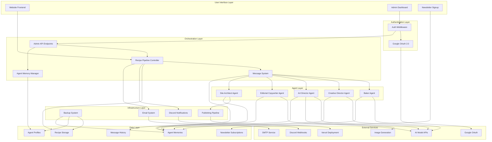

# Design Document

## Overview

The AI Creative Team System is a multi-agent orchestration platform that simulates a realistic creative workplace where AI agents with distinct personalities collaborate to produce muffin tin recipes. The system emphasizes authentic character interactions, persistent personality development, and entertainment value through workplace dynamics.

The architecture supports a core team of five agents (Baker, Creative Director, Art Director, Editorial Copywriter, Site Architect) with planned expansion to include Screenwriters and Social Media Specialist. Each agent maintains persistent memory, communicates through structured messaging, and exhibits consistent personality traits that create natural workplace tension and collaboration.

## Architecture

### Technology Stack Clarification

**Backend**: Python - All AI agent orchestration, message systems, pipeline management, and data processing will be implemented in Python.

**Infrastructure**: 
- **Authentication**: Google OAuth 2.0 for admin access
- **Database**: JSON file-based storage with automated backup system
- **Hosting**: Vercel for static site deployment
- **Notifications**: Discord webhooks for system monitoring
- **Email**: SMTP service for newsletter management

**Frontend**: Static HTML + Tailwind CSS (existing) - The current static website architecture remains unchanged except for two specific additions:
1. Featured recipe section above the existing recipe grid
2. Newsletter signup form between the featured section and recipe grid

**No Changes to Existing Frontend**: The current recipe grid, styling, mobile responsiveness, and "Jump to Recipe" functionality remain exactly as implemented.

### High-Level Architecture



### Core Design Principles

1. **Personality-First Architecture**: Every system component is designed to support and enhance agent personalities rather than optimize for pure efficiency
2. **Authentic Workplace Simulation**: Communication patterns, decision-making processes, and conflict resolution mirror real creative team dynamics
3. **Persistent Character Development**: Agent memories and relationships evolve over time, creating continuity and growth
4. **Entertainment Value**: System generates engaging behind-the-scenes content through natural agent interactions
5. **Modular Expansion**: Architecture supports adding new agent types without disrupting existing workflows

## Components and Interfaces

### Agent Framework

#### Agent Base Class
```python
class Agent:
    def __init__(self, role: str, personality_config: PersonalityConfig):
        self.role = role
        self.personality = personality_config
        self.memory = AgentMemory(role)
        self.message_handler = MessageHandler(role)
        
    def process_task(self, task: Task) -> TaskResult:
        # Consult memory for personality-relevant context
        context = self.memory.get_relevant_context(task)
        
        # Apply personality traits to decision-making
        approach = self.personality.influence_approach(task, context)
        
        # Execute task with personality-driven behavior
        result = self.execute_with_personality(task, approach)
        
        # Store experience in memory
        self.memory.record_experience(task, result, self.get_emotional_response())
        
        return result
        
    def send_message(self, recipient: str, content: str, message_type: MessageType):
        message = self.personality.style_message(content, recipient, message_type)
        self.message_handler.send(recipient, message)
        
    def receive_message(self, sender: str, message: Message) -> Optional[Message]:
        # Process message through personality filter
        response = self.personality.generate_response(message, self.memory)
        if response:
            self.memory.record_interaction(sender, message, response)
        return response
```

#### Personality Configuration System
```python
class PersonalityConfig:
    def __init__(self, 
                 core_traits: Dict[str, float],
                 backstory: str,
                 communication_style: CommunicationStyle,
                 quirks: List[str],
                 triggers: List[str]):
        self.core_traits = core_traits  # e.g., {"grumpiness": 0.8, "perfectionism": 0.9}
        self.backstory = backstory
        self.communication_style = communication_style
        self.quirks = quirks
        self.triggers = triggers  # Things that cause strong reactions
        
    def influence_approach(self, task: Task, context: MemoryContext) -> TaskApproach:
        # Apply personality traits to modify task execution
        approach = TaskApproach(base_strategy=task.default_strategy)
        
        # Modify based on core traits
        if self.core_traits.get("perfectionism", 0) > 0.7:
            approach.add_extra_validation_steps()
            
        if self.core_traits.get("traditionalism", 0) > 0.6:
            approach.prefer_established_methods()
            
        # Apply quirks and triggers
        for trigger in self.triggers:
            if trigger in task.content:
                approach.add_emotional_reaction(trigger)
                
        return approach
```

### Message System

#### Message Types and Routing
```python
class MessageType(Enum):
    TASK_ASSIGNMENT = "task_assignment"
    FEEDBACK_REQUEST = "feedback_request"
    REVISION_REQUEST = "revision_request"
    APPROVAL_NOTIFICATION = "approval_notification"
    CREATIVE_SUGGESTION = "creative_suggestion"
    GOSSIP = "gossip"  # Future feature
    
class Message:
    def __init__(self, 
                 sender: str,
                 recipient: str,
                 content: str,
                 message_type: MessageType,
                 context: Optional[Dict] = None):
        self.sender = sender
        self.recipient = recipient
        self.content = content
        self.message_type = message_type
        self.context = context or {}
        self.timestamp = datetime.now()
        self.id = generate_message_id()

class MessageSystem:
    def __init__(self):
        self.message_queue = {}  # recipient -> List[Message]
        self.message_history = []
        self.gossip_channels = {}  # Future feature
        
    def send_message(self, message: Message):
        # Add to recipient's queue
        if message.recipient not in self.message_queue:
            self.message_queue[message.recipient] = []
        self.message_queue[message.recipient].append(message)
        
        # Log for process documentation
        self.message_history.append(message)
        
    def get_messages_for_agent(self, agent_role: str) -> List[Message]:
        return self.message_queue.get(agent_role, [])
        
    def mark_message_processed(self, message_id: str, response: Optional[Message] = None):
        # Remove from queue and optionally send response
        if response:
            self.send_message(response)
```

### Infrastructure Components

#### Authentication System
```python
class AuthenticationManager:
    def __init__(self, google_client_id: str, google_client_secret: str, authorized_emails: List[str]):
        self.google_client_id = google_client_id
        self.google_client_secret = google_client_secret
        self.authorized_emails = set(authorized_emails)
        self.active_sessions = {}
        
    def authenticate_user(self, oauth_token: str) -> Optional[AuthenticatedUser]:
        # Verify Google OAuth token
        user_info = self.verify_google_token(oauth_token)
        if not user_info:
            return None
            
        # Check if user is authorized
        if user_info.email not in self.authorized_emails:
            raise UnauthorizedUserError(f"User {user_info.email} not authorized")
            
        # Create session
        session_id = self.create_session(user_info)
        return AuthenticatedUser(
            email=user_info.email,
            session_id=session_id,
            expires_at=datetime.now() + timedelta(hours=24)
        )
        
    def verify_session(self, session_id: str) -> bool:
        session = self.active_sessions.get(session_id)
        return session and session.expires_at > datetime.now()

class AdminAPIEndpoints:
    def __init__(self, auth_manager: AuthenticationManager, pipeline: RecipePipeline):
        self.auth_manager = auth_manager
        self.pipeline = pipeline
        
    @require_authentication
    def get_all_recipes(self, session_id: str, state_filter: Optional[RecipeState] = None) -> List[Recipe]:
        recipes = self.pipeline.get_recipes()
        if state_filter:
            recipes = [r for r in recipes if r.state == state_filter]
        return recipes
        
    @require_authentication  
    def transition_recipe_state(self, session_id: str, recipe_id: str, new_state: RecipeState) -> bool:
        # Log admin action
        self.log_admin_action(session_id, f"transition_recipe_state", {"recipe_id": recipe_id, "new_state": new_state})
        return self.pipeline.force_state_transition(recipe_id, new_state)
        
    @require_authentication
    def get_agent_status(self, session_id: str) -> Dict[str, AgentStatus]:
        return {role: agent.get_status() for role, agent in self.pipeline.agents.items()}
```

#### Publishing Pipeline
```python
class PublishingPipeline:
    def __init__(self, vercel_token: str, site_domain: str):
        self.vercel_token = vercel_token
        self.site_domain = site_domain
        self.template_engine = TemplateEngine()
        
    def publish_recipe(self, recipe: Recipe, creation_story: CreationStory) -> PublishResult:
        try:
            # Generate static HTML files
            recipe_html = self.template_engine.render_recipe_page(recipe, creation_story)
            story_html = self.template_engine.render_story_page(creation_story)
            
            # Update recipe grid
            self.update_recipe_grid(recipe)
            
            # Deploy to Vercel
            deployment_result = self.deploy_to_vercel([
                (f"recipes/{recipe.slug}.html", recipe_html),
                (f"stories/{recipe.slug}.html", story_html)
            ])
            
            if deployment_result.success:
                return PublishResult(success=True, url=f"https://{self.site_domain}/recipes/{recipe.slug}")
            else:
                raise DeploymentError(deployment_result.error)
                
        except Exception as e:
            return PublishResult(success=False, error=str(e))
            
    def deploy_to_vercel(self, files: List[Tuple[str, str]]) -> DeploymentResult:
        # Implementation for Vercel API deployment
        pass
        
    def update_recipe_grid(self, recipe: Recipe):
        # Update main page recipe grid with new recipe
        grid_data = self.load_recipe_grid_data()
        grid_data.insert(0, recipe.to_grid_item())  # Add to top
        self.save_recipe_grid_data(grid_data)
```

#### Newsletter System
```python
class NewsletterManager:
    def __init__(self, smtp_config: SMTPConfig):
        self.smtp_config = smtp_config
        self.subscriptions = self.load_subscriptions()
        
    def subscribe_email(self, email: str) -> SubscriptionResult:
        # Validate email format
        if not self.is_valid_email(email):
            return SubscriptionResult(success=False, error="Invalid email format")
            
        # Check for duplicates
        if email in self.subscriptions:
            return SubscriptionResult(success=False, error="Email already subscribed")
            
        # Add subscription
        subscription = Subscription(
            email=email,
            subscribed_at=datetime.now(),
            confirmed=False,
            unsubscribe_token=self.generate_unsubscribe_token()
        )
        
        self.subscriptions[email] = subscription
        self.save_subscriptions()
        
        # Send confirmation email
        self.send_confirmation_email(subscription)
        
        return SubscriptionResult(success=True, message="Confirmation email sent")
        
    def send_confirmation_email(self, subscription: Subscription):
        confirmation_link = f"https://{self.site_domain}/confirm/{subscription.unsubscribe_token}"
        email_content = self.render_confirmation_email(subscription.email, confirmation_link)
        self.send_email(subscription.email, "Confirm your muffin tin recipe subscription", email_content)
        
    def unsubscribe(self, token: str) -> bool:
        for email, subscription in self.subscriptions.items():
            if subscription.unsubscribe_token == token:
                del self.subscriptions[email]
                self.save_subscriptions()
                return True
        return False
```

#### Discord Notification System
```python
class DiscordNotificationSystem:
    def __init__(self, webhook_url: str):
        self.webhook_url = webhook_url
        
    def notify_recipe_created(self, recipe: Recipe, baker: Agent):
        message = {
            "embeds": [{
                "title": "🧁 New Recipe Created!",
                "description": f"The Baker has created a new recipe: **{recipe.title}**",
                "color": 0x8B4513,  # Brown color
                "fields": [
                    {"name": "Baker's Mood", "value": baker.get_current_mood(), "inline": True},
                    {"name": "Recipe Type", "value": recipe.category, "inline": True}
                ],
                "timestamp": datetime.now().isoformat()
            }]
        }
        self.send_webhook(message)
        
    def notify_recipe_approved(self, recipe: Recipe, creative_director: Agent):
        message = {
            "embeds": [{
                "title": "✅ Recipe Approved!",
                "description": f"The Creative Director approved: **{recipe.title}**",
                "color": 0x00FF00,  # Green color
                "fields": [
                    {"name": "CD's Feedback", "value": creative_director.get_last_feedback()[:100] + "...", "inline": False}
                ],
                "timestamp": datetime.now().isoformat()
            }]
        }
        self.send_webhook(message)
        
    def notify_system_error(self, error: Exception, component: str):
        message = {
            "embeds": [{
                "title": "🚨 System Error",
                "description": f"Error in {component}: {str(error)[:200]}",
                "color": 0xFF0000,  # Red color
                "timestamp": datetime.now().isoformat()
            }]
        }
        self.send_webhook(message)
        
    def send_daily_summary(self, summary: DailySummary):
        message = {
            "embeds": [{
                "title": "📊 Daily Creative Team Summary",
                "description": f"Here's what the team accomplished today:",
                "color": 0x4169E1,  # Royal blue
                "fields": [
                    {"name": "Recipes Created", "value": str(summary.recipes_created), "inline": True},
                    {"name": "Recipes Approved", "value": str(summary.recipes_approved), "inline": True},
                    {"name": "Recipes Published", "value": str(summary.recipes_published), "inline": True},
                    {"name": "Team Mood", "value": summary.overall_team_mood, "inline": False}
                ],
                "timestamp": datetime.now().isoformat()
            }]
        }
        self.send_webhook(message)
```

#### Backup and Recovery System
```python
class BackupSystem:
    def __init__(self, backup_locations: List[str], retention_policy: RetentionPolicy):
        self.backup_locations = backup_locations
        self.retention_policy = retention_policy
        
    def create_daily_backup(self) -> BackupResult:
        timestamp = datetime.now().strftime("%Y%m%d_%H%M%S")
        backup_name = f"ai_creative_team_backup_{timestamp}"
        
        try:
            # Collect all data to backup
            backup_data = {
                "recipes": self.collect_recipe_data(),
                "agent_memories": self.collect_agent_memories(),
                "agent_profiles": self.collect_agent_profiles(),
                "message_history": self.collect_message_history(),
                "newsletter_subscriptions": self.collect_newsletter_data(),
                "system_config": self.collect_system_config(),
                "backup_metadata": {
                    "created_at": datetime.now().isoformat(),
                    "version": self.get_system_version(),
                    "data_integrity_hash": self.calculate_data_hash()
                }
            }
            
            # Create backup archive
            backup_file = self.create_backup_archive(backup_name, backup_data)
            
            # Verify backup integrity
            if not self.verify_backup_integrity(backup_file):
                raise BackupIntegrityError("Backup verification failed")
                
            # Store in multiple locations
            storage_results = []
            for location in self.backup_locations:
                result = self.store_backup(backup_file, location)
                storage_results.append(result)
                
            # Clean up old backups according to retention policy
            self.cleanup_old_backups()
            
            return BackupResult(
                success=True,
                backup_name=backup_name,
                storage_results=storage_results,
                size_bytes=os.path.getsize(backup_file)
            )
            
        except Exception as e:
            return BackupResult(success=False, error=str(e))
            
    def restore_from_backup(self, backup_name: str) -> RestoreResult:
        try:
            # Find and download backup
            backup_file = self.retrieve_backup(backup_name)
            
            # Verify backup integrity
            if not self.verify_backup_integrity(backup_file):
                raise BackupIntegrityError("Backup file is corrupted")
                
            # Extract backup data
            backup_data = self.extract_backup_archive(backup_file)
            
            # Create system snapshot before restore
            pre_restore_snapshot = self.create_system_snapshot()
            
            # Restore data
            self.restore_recipe_data(backup_data["recipes"])
            self.restore_agent_memories(backup_data["agent_memories"])
            self.restore_agent_profiles(backup_data["agent_profiles"])
            self.restore_message_history(backup_data["message_history"])
            self.restore_newsletter_data(backup_data["newsletter_subscriptions"])
            
            # Verify system integrity after restore
            if not self.verify_system_integrity():
                # Rollback to pre-restore state
                self.restore_system_snapshot(pre_restore_snapshot)
                raise RestoreError("System integrity check failed after restore")
                
            return RestoreResult(
                success=True,
                restored_at=datetime.now(),
                backup_metadata=backup_data["backup_metadata"]
            )
            
        except Exception as e:
            return RestoreResult(success=False, error=str(e))
```
```

### Recipe Pipeline Controller

#### Pipeline State Management
```python
class PipelineStage(Enum):
    IDEATION = "ideation"
    RECIPE_CREATION = "recipe_creation"
    COPYWRITING = "copywriting"
    PHOTOGRAPHY = "photography"
    CREATIVE_REVIEW = "creative_review"
    REVISION = "revision"
    DEPLOYMENT = "deployment"
    COMPLETED = "completed"

class RecipePipeline:
    def __init__(self, message_system: MessageSystem, agents: Dict[str, Agent]):
        self.message_system = message_system
        self.agents = agents
        self.active_recipes = {}  # recipe_id -> PipelineState
        
    def start_recipe_production(self, recipe_idea: str) -> str:
        recipe_id = generate_recipe_id()
        self.active_recipes[recipe_id] = PipelineStage.RECIPE_CREATION
        
        # Send initial task to Baker
        task_message = Message(
            sender="system",
            recipient="baker",
            content=f"Create a muffin tin recipe based on: {recipe_idea}",
            message_type=MessageType.TASK_ASSIGNMENT,
            context={"recipe_id": recipe_id}
        )
        self.message_system.send_message(task_message)
        
        return recipe_id
        
    def advance_pipeline(self, recipe_id: str, completed_stage: PipelineStage):
        current_stage = self.active_recipes[recipe_id]
        next_stage = self.get_next_stage(current_stage)
        
        if next_stage:
            self.active_recipes[recipe_id] = next_stage
            self.assign_next_task(recipe_id, next_stage)
        else:
            self.active_recipes[recipe_id] = PipelineStage.COMPLETED
            
    def assign_next_task(self, recipe_id: str, stage: PipelineStage):
        stage_assignments = {
            PipelineStage.COPYWRITING: "editorial_copywriter",
            PipelineStage.PHOTOGRAPHY: "art_director", 
            PipelineStage.CREATIVE_REVIEW: "creative_director",
            PipelineStage.DEPLOYMENT: "site_architect"
        }
        
        if stage in stage_assignments:
            agent_role = stage_assignments[stage]
            task_message = self.create_stage_task_message(recipe_id, stage, agent_role)
            self.message_system.send_message(task_message)
```

## Data Models

### Agent Profile Schema
```python
@dataclass
class AgentProfile:
    role: str
    name: str
    age: int
    gender: str
    personality_traits: Dict[str, float]
    backstory: str
    communication_style: str
    quirks: List[str]
    triggers: List[str]
    current_mood: float  # -1.0 to 1.0
    relationships: Dict[str, float]  # other_agent -> relationship_score
    
    # Specific personality details
    baker_traditionalism_level: Optional[float] = None
    creative_director_pressure_level: Optional[float] = None
    art_director_pretentiousness: Optional[float] = None
    copywriter_frustration_level: Optional[float] = None
    site_architect_laziness: Optional[float] = None

@dataclass 
class AgentMemory:
    agent_role: str
    formative_experiences: List[Dict]
    emotional_responses: List[Dict]
    creative_preferences: Dict[str, Any]
    relationship_history: Dict[str, List[Dict]]
    character_growth_moments: List[Dict]
    
    def record_experience(self, task: Task, result: TaskResult, emotion: EmotionalResponse):
        experience = {
            "timestamp": datetime.now(),
            "task_type": task.type,
            "outcome": result.success,
            "emotional_impact": emotion.intensity,
            "personality_influence": emotion.personality_factors,
            "lessons_learned": result.insights
        }
        
        if emotion.intensity > 0.7:  # Significant emotional impact
            self.formative_experiences.append(experience)
        else:
            self.emotional_responses.append(experience)
```

### Recipe and Production Schema
```python
@dataclass
class Recipe:
    id: str
    slug: str
    title: str
    description: str
    why_muffin_pans: str
    category: RecipeCategory
    yield_info: YieldInfo
    prep_time_minutes: int
    cook_time_minutes: int
    ingredients: List[Ingredient]
    instructions: List[Instruction]
    tips: List[str]
    image_path: str
    created_at: datetime
    
    # Creative process tracking
    creation_story: CreationStory
    agent_contributions: Dict[str, AgentContribution]
    editorial_notes: Dict[str, str]
    
@dataclass
class CreationStory:
    recipe_id: str
    timeline: List[CreationEvent]
    key_decisions: List[Decision]
    conflicts_and_resolutions: List[Conflict]
    final_outcome: str
    
    def generate_story_summary(self) -> str:
        # Create curated narrative for public consumption
        pass
        
    def generate_full_story(self) -> str:
        # Complete behind-the-scenes documentation
        pass

@dataclass
class CreationEvent:
    timestamp: datetime
    agent: str
    action: str
    details: str
    emotional_context: Optional[str] = None
    
@dataclass
class Conflict:
    participants: List[str]
    issue: str
    positions: Dict[str, str]  # agent -> their position
    resolution: str
    resolution_method: str  # compromise, creative_director_decision, etc.
```

### Message and Communication Schema
```python
@dataclass
class MessageHistory:
    recipe_id: str
    conversation_threads: List[ConversationThread]
    
@dataclass
class ConversationThread:
    participants: List[str]
    topic: str
    messages: List[Message]
    outcome: Optional[str] = None
    
    def extract_personality_moments(self) -> List[PersonalityMoment]:
        # Identify moments where personality traits were clearly displayed
        moments = []
        for message in self.messages:
            if self.shows_personality_trait(message):
                moments.append(PersonalityMoment(
                    agent=message.sender,
                    trait_displayed=self.identify_trait(message),
                    context=message.content,
                    timestamp=message.timestamp
                ))
        return moments
```

### Infrastructure Data Models

#### Recipe State Management
```python
class RecipeState(Enum):
    PENDING = "pending"
    APPROVED = "approved" 
    PUBLISHED = "published"
    REJECTED = "rejected"

@dataclass
class RecipeStateTransition:
    recipe_id: str
    from_state: RecipeState
    to_state: RecipeState
    timestamp: datetime
    triggered_by: str  # agent role or "admin"
    reason: Optional[str] = None
    
@dataclass
class RecipeWithState(Recipe):
    state: RecipeState
    state_history: List[RecipeStateTransition]
    
    def transition_to(self, new_state: RecipeState, triggered_by: str, reason: Optional[str] = None):
        if not self.is_valid_transition(self.state, new_state):
            raise InvalidStateTransitionError(f"Cannot transition from {self.state} to {new_state}")
            
        transition = RecipeStateTransition(
            recipe_id=self.id,
            from_state=self.state,
            to_state=new_state,
            timestamp=datetime.now(),
            triggered_by=triggered_by,
            reason=reason
        )
        
        self.state_history.append(transition)
        self.state = new_state
        
    def is_valid_transition(self, from_state: RecipeState, to_state: RecipeState) -> bool:
        valid_transitions = {
            RecipeState.PENDING: [RecipeState.APPROVED, RecipeState.REJECTED],
            RecipeState.APPROVED: [RecipeState.PUBLISHED, RecipeState.REJECTED],
            RecipeState.REJECTED: [RecipeState.PENDING],  # Can be revised
            RecipeState.PUBLISHED: []  # Terminal state
        }
        return to_state in valid_transitions.get(from_state, [])
```

#### Authentication and Session Management
```python
@dataclass
class AuthenticatedUser:
    email: str
    session_id: str
    expires_at: datetime
    permissions: List[str]
    
@dataclass
class AdminAction:
    session_id: str
    user_email: str
    action: str
    parameters: Dict[str, Any]
    timestamp: datetime
    success: bool
    error_message: Optional[str] = None
```

#### Newsletter System Models
```python
@dataclass
class Subscription:
    email: str
    subscribed_at: datetime
    confirmed: bool
    unsubscribe_token: str
    confirmation_sent_at: Optional[datetime] = None
    confirmed_at: Optional[datetime] = None
    
@dataclass
class SubscriptionResult:
    success: bool
    message: Optional[str] = None
    error: Optional[str] = None
    
@dataclass
class NewsletterCampaign:
    id: str
    subject: str
    content: str
    sent_at: datetime
    recipient_count: int
    open_rate: Optional[float] = None
    click_rate: Optional[float] = None
```

#### Publishing and Deployment Models
```python
@dataclass
class PublishResult:
    success: bool
    url: Optional[str] = None
    error: Optional[str] = None
    deployment_id: Optional[str] = None
    
@dataclass
class DeploymentResult:
    success: bool
    deployment_id: str
    url: Optional[str] = None
    error: Optional[str] = None
    deployed_files: List[str] = None
    
@dataclass
class StaticSiteUpdate:
    recipe_id: str
    files_generated: List[str]
    deployment_result: DeploymentResult
    timestamp: datetime
```

#### Notification System Models
```python
@dataclass
class NotificationEvent:
    event_type: str
    timestamp: datetime
    data: Dict[str, Any]
    recipients: List[str]  # Discord channels, email lists, etc.
    
@dataclass
class DailySummary:
    date: datetime
    recipes_created: int
    recipes_approved: int
    recipes_published: int
    recipes_rejected: int
    overall_team_mood: str
    notable_events: List[str]
    agent_highlights: Dict[str, str]  # agent_role -> highlight
```

#### Backup System Models
```python
@dataclass
class BackupResult:
    success: bool
    backup_name: Optional[str] = None
    storage_results: List[Dict] = None
    size_bytes: Optional[int] = None
    error: Optional[str] = None
    
@dataclass
class RestoreResult:
    success: bool
    restored_at: Optional[datetime] = None
    backup_metadata: Optional[Dict] = None
    error: Optional[str] = None
    
@dataclass
class RetentionPolicy:
    daily_backups_days: int = 30
    weekly_backups_weeks: int = 26  # 6 months
    monthly_backups_months: int = 12
    
@dataclass
class BackupMetadata:
    created_at: datetime
    system_version: str
    data_integrity_hash: str
    backup_size_bytes: int
    included_components: List[str]
```

## Correctness Properties

*A property is a characteristic or behavior that should hold true across all valid executions of a system-essentially, a formal statement about what the system should do. Properties serve as the bridge between human-readable specifications and machine-verifiable correctness guarantees.*

Based on the prework analysis, the following properties ensure the AI Creative Team System operates correctly:

### Property 1: Agent Personality Persistence
*For any* system restart or reinitialization, each agent role should maintain the exact same personality traits, backstory, and behavioral parameters as before the restart.
**Validates: Requirements 1.2**

### Property 2: Agent Initialization Completeness  
*For any* agent initialization, the resulting agent should have all required personality components: core traits, backstory, communication style, quirks, and triggers.
**Validates: Requirements 1.3**

### Property 3: Pipeline Stage Completeness
*For any* recipe idea submitted to the pipeline, the system should process it through all required stages (recipe creation, copywriting, photography, creative review, deployment) without skipping any stage.
**Validates: Requirements 2.1**

### Property 4: Baker Recipe Creation
*For any* recipe creation task assigned to the Baker, the output should include a recipe concept, ingredient list with quantities, and cooking instructions appropriate for muffin tin format.
**Validates: Requirements 2.2**

### Property 5: Agent Memory Persistence
*For any* agent in the system, there should exist a persistent memory file that contains personality-focused experiences rather than operational data.
**Validates: Requirements 3.1**

### Property 6: Experience Recording
*For any* significant agent experience (high emotional impact), the system should record the experience with emotional context, personality factors, and character development insights in the agent's memory.
**Validates: Requirements 3.2**

### Property 7: Creative Director Review Consistency
*For any* complete recipe package, the Creative Director should apply consistent quality standards and provide feedback that reflects their personality traits (supportive but under pressure).
**Validates: Requirements 6.1, 6.2**

### Property 8: Message Delivery Accuracy
*For any* message sent between agents, the message should be delivered only to the specified recipient with all metadata (sender, timestamp, content) intact.
**Validates: Requirements 10.1, 10.2**

### Property 9: Message Logging Completeness
*For any* inter-agent message sent through the system, it should be logged with sender, recipient, timestamp, message type, and content for process documentation.
**Validates: Requirements 10.3**

### Property 10: Featured Recipe Display Update
*For any* recipe selected as the featured recipe, the website display should update to show that recipe in the featured section within the expected timeframe.
**Validates: Requirements 12.2**

### Property 11: Email Validation
*For any* email address submitted to the newsletter signup, the system should correctly validate the email format and only accept properly formatted email addresses.
**Validates: Requirements 13.2**

### Property 12: Recipe State Integrity
*For any* recipe in the system, it should have exactly one of the four valid states (pending, approved, published, rejected) at any given time.
**Validates: Requirements 16.1**

### Property 13: Initial Recipe State Assignment
*For any* recipe created by the Baker, it should initially be stored in pending state.
**Validates: Requirements 16.2**

### Property 14: Creative Director Approval State Transition
*For any* recipe in pending state that receives Creative Director approval, it should transition to approved state.
**Validates: Requirements 16.3**

### Property 15: State Transition Validation
*For any* attempted recipe state transition, the system should only allow transitions between adjacent states and reject invalid transitions.
**Validates: Requirements 16.7**

### Property 16: Publishing Pipeline Trigger
*For any* recipe that reaches approved state, the system should automatically initiate static HTML file generation.
**Validates: Requirements 17.1**

### Property 17: Deployment State Update
*For any* recipe with successful deployment, the system should update the recipe state to published.
**Validates: Requirements 17.5**

### Property 18: Admin API Authentication
*For any* request to admin API endpoints, the system should reject requests from unauthenticated users.
**Validates: Requirements 18.4**

### Property 19: Admin Email Authorization
*For any* authentication attempt, the system should only grant access to users with email addresses in the authorized whitelist.
**Validates: Requirements 18.6**

### Property 20: Newsletter Email Format Validation
*For any* email address submitted for newsletter subscription, the system should validate the format and reject improperly formatted addresses.
**Validates: Requirements 19.5**

### Property 21: Newsletter Subscription Uniqueness
*For any* email address, the system should prevent duplicate newsletter subscriptions.
**Validates: Requirements 19.6**

### Property 22: Discord Notification Triggers
*For any* recipe state change (created, approved, rejected, published), the system should send corresponding Discord webhook notifications.
**Validates: Requirements 20.1**

### Property 23: Backup Data Completeness
*For any* daily backup created, it should include all recipe data, agent memories, agent profiles, message history, and system configuration.
**Validates: Requirements 22.1**

### Property 24: Backup Integrity Verification
*For any* backup created, the system should verify its integrity and completeness before considering the backup successful.
**Validates: Requirements 22.3**

## Error Handling

### Agent Communication Failures
- **Message Delivery Failures**: If an agent is unavailable, messages are queued and delivered when the agent becomes available
- **Personality Loading Errors**: If personality configuration is corrupted, the system falls back to default personality templates while logging the error
- **Memory Corruption**: If agent memory files are corrupted, the system creates new memory files while preserving any recoverable data

### Pipeline Failures
- **Agent Task Failures**: If an agent fails to complete a task, the Creative Director is notified and can reassign the task or request revision
- **Stage Timeout**: If a pipeline stage takes too long, the system notifies the Creative Director and provides options to intervene
- **Quality Gate Failures**: If the Creative Director rejects a recipe multiple times, the system escalates to human oversight

### Data Integrity
- **Recipe Data Validation**: All recipe data is validated against the schema before storage
- **Message History Integrity**: Message logs are checksummed to prevent tampering
- **Memory Consistency**: Agent memories are validated for consistency and backed up regularly

### Graceful Degradation
- **AI Model Unavailability**: If an AI model is unavailable, agents can operate with reduced functionality using cached responses
- **External Service Failures**: If image generation or deployment services fail, the pipeline pauses at that stage rather than failing completely
- **Personality Conflicts**: If agent personalities create deadlocks, the Creative Director has override authority to resolve conflicts

### Infrastructure Error Handling
- **Authentication Failures**: If Google OAuth is unavailable, the system logs the issue and provides clear error messages to users attempting to access admin functions
- **Deployment Failures**: If Vercel deployment fails, the recipe remains in approved state and the Site Architect is notified to retry manually
- **Backup Failures**: If daily backups fail, the system immediately attempts backup to alternate locations and sends Discord alerts
- **Email Service Failures**: If SMTP service is unavailable, newsletter subscriptions are queued and processed when service is restored
- **Discord Webhook Failures**: If Discord notifications fail, events are logged locally and retried with exponential backoff
- **Database Corruption**: If data files become corrupted, the system automatically attempts recovery from the most recent backup
- **State Transition Conflicts**: If multiple processes attempt to change recipe state simultaneously, the system uses file locking to prevent corruption

## Testing Strategy

### Dual Testing Approach
The system requires both unit testing and property-based testing to ensure comprehensive coverage:

**Unit Tests** focus on:
- Specific personality configurations for each agent type
- Message routing between specific agent pairs  
- Pipeline stage transitions for known recipe types
- Error handling for specific failure scenarios
- Integration points between system components

**Property-Based Tests** focus on:
- Universal properties that hold across all agent interactions
- Pipeline behavior with randomly generated recipe ideas
- Message system behavior with various message types and volumes
- Memory system consistency across different experience types
- Personality persistence across system restarts and reconfigurations

### Property-Based Testing Configuration
- **Minimum 100 iterations** per property test to ensure comprehensive input coverage
- **Test Framework**: Use Hypothesis (Python) for property-based testing
- **Agent Generators**: Create smart generators that produce realistic agent configurations, recipe ideas, and message patterns
- **Personality Consistency**: Generate various personality configurations and verify they remain consistent across operations

### Test Tagging Format
Each property-based test must reference its design document property:
- **Feature: ai-creative-team, Property 1: Agent Personality Persistence**
- **Feature: ai-creative-team, Property 2: Agent Initialization Completeness**
- And so forth for all properties

### Integration Testing
- **End-to-End Pipeline Tests**: Verify complete recipe production from idea to deployment
- **Multi-Agent Interaction Tests**: Test complex scenarios involving multiple agents and message exchanges
- **Personality Consistency Tests**: Verify agent personalities remain consistent during extended interactions
- **Memory Evolution Tests**: Test that agent memories develop appropriately over time
- **Infrastructure Integration Tests**: Test authentication, publishing pipeline, notifications, and backup systems
- **State Management Tests**: Verify recipe state transitions work correctly under various conditions
- **Security Tests**: Validate authentication, authorization, and data protection mechanisms
- **Disaster Recovery Tests**: Test backup and restore procedures with various failure scenarios

The testing strategy ensures both the functional correctness of the system and the authenticity of the agent personalities and interactions, while also validating the reliability and security of the infrastructure components.
