# Muffin Pan Recipes - Recipe Production Workflow

## Overview

This document defines the complete workflow for producing a recipe, from initial idea to published content. It maps each agent's role, decision points, and data flow.

---

## The Creative Team (Agents)

| Agent | Name | Role | When Involved | Model |
|-------|------|------|---------------|-------|
| **Baker** | Margaret Chen | Recipe Development | Stage 1 | Ollama (llama3.2) |
| **Art Director** | Julian Torres | Photography Direction | Stage 2 | GPT-4o (planned) |
| **Copywriter** | Marcus Reid | Editorial Copy | Stage 3 | Ollama (llama3.2) |
| **Creative Director** | Steph Whitmore | Quality Review | Stage 4 | DeepSeek-R1 (planned) |
| **Site Architect** | Devon Park | Deployment | Stage 5 | Qwen (planned) |
| **Screenwriter** | TBD | Captures Tension | Throughout | Claude (planned) |
| **Social Dispatcher** | TBD | Social Media | Post-publish | Gemini Flash (planned) |

**Status:** Baker and Copywriter have LLM integration. Others use placeholder logic.

---

## Workflow Diagram (Mermaid)

```mermaid
flowchart TD
    subgraph INPUT["📥 INPUT"]
        A[Recipe Idea/Concept]
    end

    subgraph STAGE1["🥧 STAGE 1: Recipe Development"]
        B[Margaret Chen<br/>Baker]
        B1[Generate Ingredients]
        B2[Generate Instructions]
        B3[Chef Notes]
        B --> B1 --> B2 --> B3
    end

    subgraph STAGE2["📸 STAGE 2: Photography"]
        C[Julian Torres<br/>Art Director]
        C1[Generate 3 Image Variants]
        C2[Select Best Image]
        C3[Apply Style Guide]
        C --> C1 --> C2 --> C3
    end

    subgraph STAGE3["✍️ STAGE 3: Copywriting"]
        D[Marcus Reid<br/>Copywriter]
        D1[Write Description]
        D2[Literary Polish]
        D3[SEO Optimization]
        D --> D1 --> D2 --> D3
    end

    subgraph STAGE4["👀 STAGE 4: Creative Review"]
        E[Steph Whitmore<br/>Creative Director]
        E1{Quality Check}
        E --> E1
    end

    subgraph STAGE4B["🔄 REVISION LOOP"]
        F[Feedback to Agents]
        F1[Identify Issues]
        F2[Request Revisions]
        F --> F1 --> F2
    end

    subgraph STAGE5["👤 STAGE 5: Human Review"]
        G[Erik<br/>Human Reviewer]
        G1{Approve?}
        G --> G1
    end

    subgraph STAGE6["🚀 STAGE 6: Deployment"]
        H[Devon Park<br/>Site Architect]
        H1[Generate HTML]
        H2[Update recipes.json]
        H3[Update sitemap.xml]
        H4[Deploy to Vercel]
        H --> H1 --> H2 --> H3 --> H4
    end

    subgraph STAGE7["📱 STAGE 7: Social Distribution"]
        I[Social Dispatcher]
        I1[Pinterest Pin]
        I2[Instagram Post]
        I --> I1
        I --> I2
    end

    subgraph OUTPUT["📤 OUTPUT"]
        J[Published Recipe]
        K[Behind-the-Scenes Story]
    end

    subgraph STORAGE["💾 DATA STORAGE"]
        S1[(pending/)]
        S2[(approved/)]
        S3[(published/)]
        S4[(rejected/)]
    end

    A --> B
    B3 --> S1
    S1 --> C
    C3 --> D
    D3 --> E
    E1 -->|PASS| G
    E1 -->|FAIL| F
    F2 --> B
    G1 -->|APPROVE| S2
    G1 -->|REJECT| S4
    S2 --> H
    H4 --> S3
    S3 --> J
    S3 --> I
    H4 --> K
```



---

## Workflow Stages (Detailed)

### Stage 1: Recipe Development (Baker - Margaret Chen)

**Trigger:** New recipe concept submitted
**Agent:** Margaret Chen (Baker)
**Input:** Recipe concept string (e.g., "Maple Bacon Breakfast Cups")

**Process:**
1. Margaret receives concept
2. LLM generates unique ingredients with measurements
3. LLM generates step-by-step instructions
4. Margaret adds chef notes and tips
5. Recipe data saved to `data/recipes/pending/{recipe_id}.json`

**Output:**
```yaml
title: string
ingredients: [{ amount, item, notes }]
instructions: [string]
chef_notes: string
prep_time: int
cook_time: int
servings: int
difficulty: easy|medium|hard
category: breakfast|lunch|dinner|snack|dessert
```

**Personality Moments Captured:**
- "Margaret measured ingredients twice"
- "Muttered about proper technique"
- Emotional state based on triggers (trendy ingredients)

---

### Stage 2: Photography (Art Director - Julian Torres)

**Trigger:** Recipe development complete
**Agent:** Julian Torres (Art Director)
**Input:** Recipe data from Stage 1

**Process:**
1. Julian reviews recipe for visual potential
2. Generate image prompt based on IMAGE_STYLE_GUIDE.md
3. Submit to image generation (Stability AI via RunPod)
4. Generate 3 variants
5. Select best image using style criteria
6. Image saved to `src/assets/images/{slug}.webp`

**Output:**
```yaml
image_path: string
selected_variant: 1|2|3
style_notes: string
total_shots: int (35-60, per Julian's perfectionism)
```

**Current Status:** ⚠️ Placeholder - no actual image generation connected

---

### Stage 3: Copywriting (Copywriter - Marcus Reid)

**Trigger:** Photography complete
**Agent:** Marcus Reid (Copywriter)
**Input:** Recipe data + image

**Process:**
1. Marcus receives recipe and image
2. LLM generates literary description (2000+ chars)
3. Adds cultural context, personal anecdotes
4. References food writers (MFK Fisher, Nigel Slater, etc.)
5. Description added to recipe JSON

**Output:**
```yaml
description: string (the literary description)
word_count: int
quality: string
literary_references: string
```

**Personality Moments Captured:**
- "Marcus used 'whom' twice"
- "Referenced his thesis research"
- Word count always exceeds target by 3-5x

---

### Stage 4: Creative Review (Creative Director - Steph Whitmore)

**Trigger:** Copywriting complete
**Agent:** Steph Whitmore (Creative Director)
**Input:** Complete recipe package (recipe + image + copy)

**Process:**
1. Steph reviews complete package
2. Checks against quality criteria
3. Decision: APPROVE or REQUEST_REVISIONS
4. If revisions needed, provides specific feedback

**Decision Criteria:**
- Recipe is coherent and cookable
- Image matches recipe (when real images exist)
- Description is engaging (even if overwrought)
- No glaring errors or inconsistencies

**Output:**
```yaml
decision: approved | revisions_needed
confidence: float (0-1)
feedback: string (if revisions needed)
revisit_later: boolean (Steph's indecisiveness)
```

**Current Status:** ⚠️ Placeholder - always approves

---

### Stage 5: Human Review (Erik)

**Trigger:** Creative Director approves
**Human:** Erik (site owner)
**Input:** Complete recipe package via admin dashboard

**Process:**
1. Discord notification sent
2. Erik accesses review URL (`/admin/review/{recipe_id}`)
3. Reviews recipe, description, image
4. Decision: APPROVE or REJECT (with notes)
5. Recipe moves to `approved/` or `rejected/`

**Output:**
```yaml
decision: approved | rejected
review_notes: string (optional)
reviewed_at: datetime
```

**Current Status:** ❌ NOT IMPLEMENTED - no admin dashboard

---

### Stage 6: Deployment (Site Architect - Devon Park)

**Trigger:** Human approves recipe
**Agent:** Devon Park (Site Architect)
**Input:** Approved recipe JSON

**Process:**
1. Generate static HTML from template
2. Place in `src/recipes/{slug}/index.html`
3. Update `src/recipes.json` with new entry
4. Regenerate `src/sitemap.xml`
5. Git commit with recipe details
6. Push to GitHub (triggers Vercel deploy)
7. Update recipe status to `published`
8. Send Discord notification (published)

**Output:**
```yaml
html_path: string
deployment_status: success | failed
deployed_at: datetime
vercel_url: string
```

**Current Status:** ⚠️ Partial - `build_site.py` exists but not connected to pipeline

---

### Stage 7: Social Distribution (Social Dispatcher)

**Trigger:** Deployment complete
**Agent:** Social Dispatcher (TBD)
**Input:** Published recipe URL + image

**Process:**
1. Generate Pinterest pin description
2. Generate Instagram caption
3. Schedule posts
4. Track engagement

**Current Status:** ❌ NOT IMPLEMENTED

---

## Data Flow Summary

```
Recipe Concept
    ↓
[Baker] → recipe_data.json
    ↓
[Art Director] → image.webp
    ↓
[Copywriter] → description added to recipe_data.json
    ↓
[Creative Director] → approval decision
    ↓
[Human Review] → final approval
    ↓
[Site Architect] → HTML + deploy
    ↓
[Social Dispatcher] → Pinterest/Instagram
```

---

## Revision Loop

When Creative Director requests revisions:

```
[Creative Director] FAIL
    ↓
Feedback logged
    ↓
[Baker] receives revision request
    ↓
Recipe modified
    ↓
Back to [Art Director] if image affected
    ↓
Back to [Copywriter] for description update
    ↓
[Creative Director] re-reviews
```

**Max Revision Cycles:** 3 (then escalate to human)

---

## Story Capture (Screenwriter)

Throughout the workflow, the Screenwriter captures:

- Agent interactions (who said what)
- Creative decisions (why Julian picked variant 2)
- Personality moments (Margaret's muttering)
- Tensions/disagreements between agents
- Resolution of conflicts

This becomes the "Behind the Scenes" content.

**Current Status:** ⚠️ Partial - personality moments captured, but no Screenwriter agent

---

## Status Legend

| Symbol | Meaning |
|--------|---------|
| ✅ | Fully implemented |
| ⚠️ | Partially implemented / placeholder |
| ❌ | Not implemented |

---

## Gap Analysis

| Stage | Status | Gap |
|-------|--------|-----|
| Stage 1: Baker | ✅ | None - LLM working |
| Stage 2: Photography | ⚠️ | No image generation connected |
| Stage 3: Copywriter | ✅ | None - LLM working |
| Stage 4: Creative Review | ⚠️ | Always approves, no real review |
| Stage 5: Human Review | ❌ | No admin dashboard |
| Stage 6: Deployment | ⚠️ | build_site.py exists, not connected |
| Stage 7: Social | ❌ | Not started |
| Revision Loop | ❌ | No implementation |
| Screenwriter | ⚠️ | Moments captured, no agent |

---

*Document Version: 1.0*
*Created: January 23, 2026*
*Author: Claude Code (Opus 4.5)*
